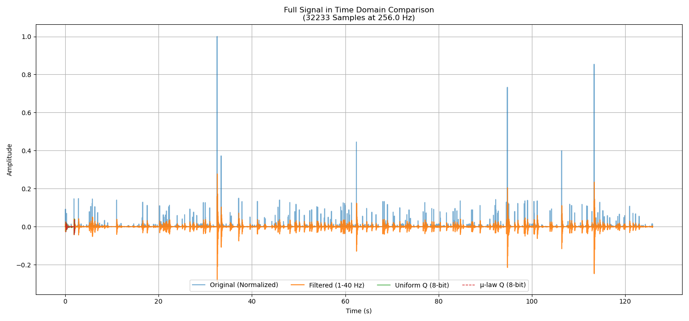
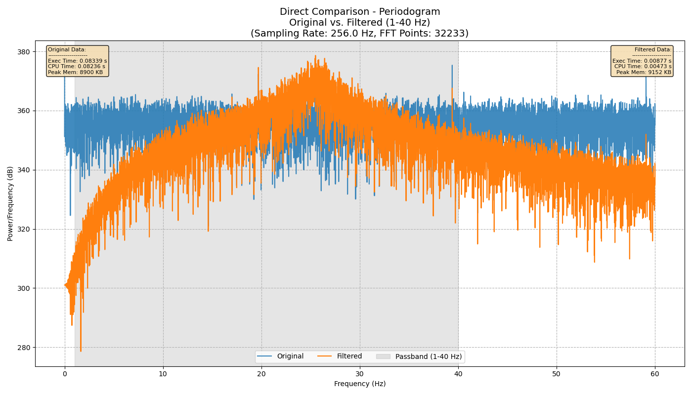
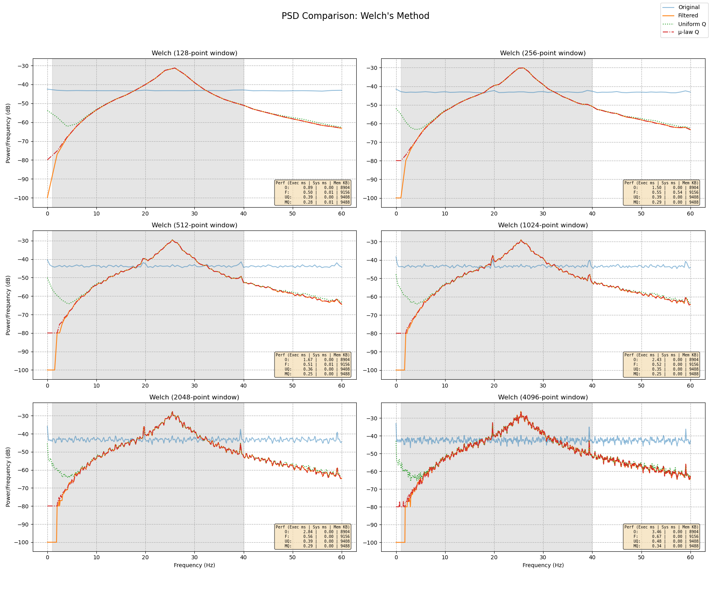
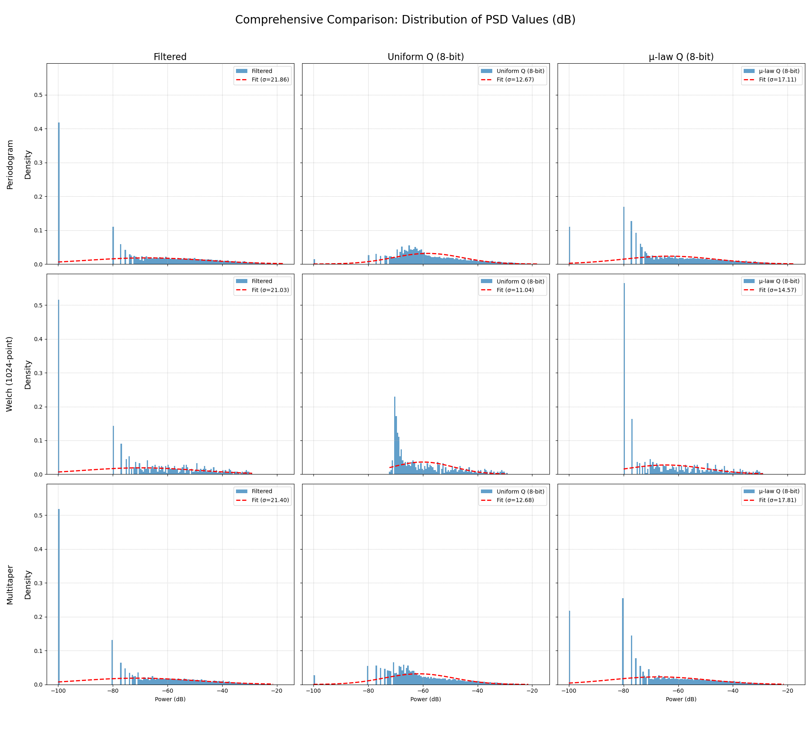

# EEG Signal Analysis and Digitalization Pipeline

This project provides a comprehensive C and Python pipeline for the analysis and simulated digitalization of time-series EEG data from the [Kaggle EEG Brainwave Dataset](https://www.kaggle.com/datasets/birdy654/eeg-brainwave-dataset-mental-state). The core numerical processing is performed in high-performance C, with Python used for advanced, publication-quality visualization.

The pipeline's primary goal is to demonstrate a complete, multi-stage signal processing workflow. It starts with a raw signal and applies standard pre-processing (normalization, filtering), then simulates its digital conversion using two different methods (uniform and non-uniform quantization). The results are compared at each of the four stages to clearly visualize the effects and trade-offs of each operation.

## Key Features

-   **Four-Stage Comparative Analysis:** The entire analysis is performed on four versions of the signal: **1. Normalized Original**, **2. Filtered**, **3. Uniformly Quantized**, and **4. μ-law Quantized**. All plots overlay these results for a direct, insightful comparison.
-   **High-Performance Core:** All numerical processing is done in C using the FFTW3 library for maximum speed.
-   **Robust Pre-processing Workflow:**
    -   **Signal Normalization:** Standardizes the signal amplitude to a **[-1, 1]** range, making the analysis scale-invariant.
    -   **Detrending:** Removes linear trends from the signal.
    -   **4th-Order Butterworth Filter:** Applies a high-order IIR filter to isolate frequencies between 1-40 Hz with a very sharp cutoff.
-   **Advanced Digitalization Simulation:**
    -   **Uniform Quantization:** Simulates standard linear ADC by mapping the signal to 256 evenly spaced amplitude levels.
    -   **Non-Uniform (μ-law) Quantization:** Implements the industry-standard μ-law companding algorithm, which provides higher resolution for lower-amplitude signals.
-   **Multiple PSD Methods:** Compares three fundamental PSD estimation techniques: Periodogram, Welch's Method, and a simplified Multitaper Method.
-   **Comprehensive Benchmarking:** Measures and displays the computational cost (execution time, user/system CPU time, peak memory) for each analysis method directly on the output plots.

## Methodology and Mathematical Foundations

The pipeline processes the signal through a series of distinct mathematical transformations. Let the initial raw signal read from the CSV be denoted as `x_raw[n]`.

### 1. Stage 1: Normalization
The first step standardizes the signal's dynamic range to `[-1, 1]`, making subsequent processing independent of the original signal's scale.

$$ x_{norm}[n] = \frac{x_{raw}[n]}{\max(|x_{raw}|)} $$

This `x_norm[n]` becomes the **"Original"** signal in all comparative plots.

### 2. Stage 2: Filtering
The normalized signal is processed with a 4th-order Butterworth IIR filter, defined by the difference equation:

$$ y[n] = \sum_{i=0}^{P} b_i x[n-i] - \sum_{j=1}^{Q} a_j y[n-j] $$

The input `x[n]` is `x_norm[n]`, and the output `y[n]` is the filtered signal, `x_filtered[n]`.

### 3. Stage 3: Quantization
The filtered signal is quantized using two different 8-bit (`N = 256` levels) methods.

#### 3a. Uniform Quantization
The amplitude range is divided into evenly spaced levels. The step size `Δ` is constant.

$$ \Delta = \frac{\max(x_{filtered}) - \min(x_{filtered})}{N - 1} $$
$$ x_{uniform\_q}[n] = \text{round}\left(\frac{x_{filtered}[n] - \min(x_{filtered})}{\Delta}\right) \cdot \Delta + \min(x_{filtered}) $$

#### 3b. Non-Uniform (μ-law) Quantization
This involves a three-step process of companding (compressing-expanding).

1.  **Compression:** The signal amplitude is passed through a logarithmic function that enhances low-amplitude values. The standard μ-law compression formula is:
    $$ x_{compressed}[n] = \text{sign}(x_{filtered}[n]) \frac{\ln(1 + \mu |x_{filtered}[n]|)}{\ln(1 + \mu)} $$
    where `μ` is the compression parameter (typically 255 for 8-bit systems).

2.  **Uniform Quantization:** The *compressed* signal is then quantized uniformly over the `[-1, 1]` range.

3.  **Expansion:** The quantized, compressed signal is passed through the inverse function to restore its original dynamic range.
    $$ x_{\mu law\_q}[n] = \text{sign}(x_{quantized\_compressed}[n]) \frac{1}{\mu} \left( (1 + \mu)^{|x_{quantized\_compressed}[n]|} - 1 \right) $$

## In-Depth Analysis of Graphical Results

Each plot is designed to tell a specific part of the story, comparing the signal at its four main processing stages.

### Full Signal in Time Domain



*   **Objective:** To visualize the overall effect of filtering and quantization on the signal's waveform.
*   **Observations:**
    1.  **Normalization:** The `Original (Normalized)` signal (blue) is correctly bounded between `[-1, 1]`, confirming the success of the initial scaling step.
    2.  **Filtering:** The `Filtered` signal (orange) is a dramatically "cleaner" version of the original. High-amplitude spikes and high-frequency oscillations are effectively removed, leaving a smoother waveform that better represents the underlying brainwave activity.
    3.  **Quantization:** Both the `Uniform Q` (green) and `μ-law Q` (red, dashed) signals are visually almost identical to the filtered signal at this scale. This indicates that an 8-bit resolution (256 levels) is sufficient to capture the primary dynamics of the filtered EEG signal without introducing obvious waveform distortion.
*   **Key Takeaway:** Pre-processing successfully cleans the signal, and 8-bit quantization (of both types) preserves the macroscopic waveform.

### Power Spectral Density (PSD) Plots



*   **Objective:** To analyze and compare the frequency content of the four signal stages. The Periodogram plot, being the most direct FFT-based estimate, is used here as the primary example.
*   **Observations:**
    1.  **Original Signal (Blue):** The spectrum is noisy and has significant power distributed across all frequencies, including those well above the 40 Hz brainwave range.
    2.  **Filtered Signal (Orange):** The effect of the 4th-order Butterworth filter is perfectly clear. The signal power is sharply confined to the 1-40 Hz passband (the gray area). The steep vertical drop at 40 Hz demonstrates the filter's high precision, resulting in a very low **noise floor** (approx. -100 dB).
    3.  **Uniform Quantization (Green):** Inside the passband, this signal tracks the filtered one. However, outside the passband, it sits on a **flat, elevated noise floor**. This is the classic signature of **uniform quantization noise**, which behaves like white noise spread evenly across the spectrum.
    4.  **μ-law Quantization (Red):** This signal also has an elevated noise floor, but it is **not flat**. The noise is lower at low frequencies and rises with frequency. This is the signature of **non-uniform quantization**, where the introduced error is signal-dependent, resulting in a shaped noise spectrum.
*   **Key Takeaway:** These plots perfectly illustrate the ideal frequency-domain behavior of a band-pass filter and the theoretical differences between the noise introduced by uniform and non-uniform quantization.

### Welch's Method Comparison



*   **Objective:** To view the PSD using a more statistically stable method and observe the effect of window size, while also comparing computational performance.
*   **Observations:** Welch's method provides a much smoother and more interpretable PSD estimate. The key observations from the Periodogram are confirmed: the filter's sharp cutoff is evident, and the distinct flat vs. shaped noise floors of the two quantization methods are even clearer. The performance metrics in the corner of each subplot show that the computational cost is very low and consistent for each stage of processing.
*   **Key Takeaway:** This plot confirms the findings from the Periodogram but with reduced variance, demonstrating the robustness of the conclusions.

### Comprehensive Distribution of PSD Values



*   **Objective:** To statistically analyze and compare the distribution of power values across all methods and processing stages.
*   **Observations (Row-wise - Comparing Methods):**
    *   The middle row (`Welch`) consistently shows the narrowest distributions (smallest `σ` values). This provides quantitative proof that **Welch's method produces the most statistically stable PSD estimate** with the lowest variance.
*   **Observations (Column-wise - Comparing Stages):**
    *   **"Filtered" Column:** All three methods show a sharp, distinct spike at very low power levels (near -100 dB). This spike represents the vast number of out-of-band frequency bins that were aggressively attenuated to near-zero power by the filter.
    *   **"Uniform Q" & "μ-law Q" Columns:** In both these columns, the sharp spike at -100 dB **completely disappears**. This is the most crucial statistical evidence: the quantization noise has raised the overall noise floor, so no frequency bins have near-zero power anymore. The shape of the main distribution also changes, reflecting the different statistical properties of the added noise.
*   **Key Takeaway:** This grid provides irrefutable statistical proof of the variance-reduction property of Welch's method and the noise-floor-raising effect of both quantization schemes.

## Project Structure
```
.
├── mental-state.csv
├── build.sh
├── Makefile
├── README.md
├── results/
│   ├── data/
│   ├── plots/
│   └── performance/
├── src/
│   ├── main.c
│   ├── csv_parser.h
│   ├── csv_parser.c
│   ├── signal_processing.h
│   ├── signal_processing.c
│   ├── performance_monitor.h
│   └── performance_monitor.c
└── scripts/
    └── plotter.py
```

## Prerequisites

### C Environment
You need a C compiler (like GCC), Make, and the FFTW3 library.
-   **On Debian/Ubuntu:** `sudo apt-get install build-essential libfftw3-dev`
-   **On Fedora/CentOS:** `sudo dnf install gcc make fftw-devel`

### Python Environment
You need Python 3 and the following libraries: `numpy`, `matplotlib`, and `scipy`.
-   **Install with pip:** `pip install numpy matplotlib scipy`

## How to Run

1.  **Make the script executable:**
    ```bash
    chmod +x build.sh
    ```
2.  **Build and Run:** This single command cleans, compiles, executes the C analyzer for all four stages, and runs the Python plotter.
    ```bash
    ./build.sh
    ```
    *Note: You must close all plot windows for the script to terminate.*

## Output Description

All output is stored in the `results/` directory, which is created automatically.

-   `results/plots/`: Contains all generated comparison plots saved as `.png` files.
-   `results/data/`: Contains intermediate data files (`.txt`) generated by the C analyzer. Files are suffixed with `_filtered`, `_uniform_quantized`, or `_mu_law_quantized` to denote the processing stage.
-   `results/performance/`: Contains `performance.txt`, a CSV file with the detailed computational cost metrics for each analysis run.