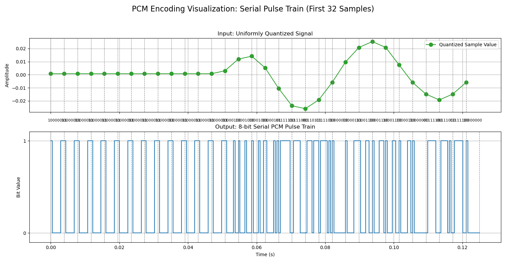

# EEG Signal Analysis and Digitalization Pipeline

This project provides a comprehensive C and Python pipeline for the analysis and simulated digitalization of time-series EEG data from the [Kaggle EEG Brainwave Dataset](https://www.kaggle.com/datasets/birdy654/eeg-brainwave-dataset-mental-state). The core numerical processing is performed in high-performance C, with Python used for advanced, publication-quality visualization.

The pipeline's primary goal is to demonstrate a complete, multi-stage signal processing workflow. It starts with a raw signal and applies standard pre-processing (normalization, filtering), then simulates its digital conversion using two different methods (uniform and non-uniform quantization). Finally, it visualizes the resulting binary stream from a Pulse Code Modulation (PCM) encoder. The results are compared at each stage to clearly visualize the effects and trade-offs of each operation.

## Key Features

-   **Four-Stage Comparative Analysis:** The entire analysis is performed on four versions of the signal: **1. Normalized Original**, **2. Filtered**, **3. Uniformly Quantized**, and **4. μ-law Quantized**. All analysis plots overlay these results for a direct comparison.
-   **Demonstration of PCM Theory:** The pipeline serves as a practical demonstration of **Pulse Code Modulation (PCM)**, the fundamental process of digital signal conversion. It explicitly simulates the core steps:
    -   **Sampling:** Implicitly handled by using a discrete-time dataset (Fs = 256 Hz).
    -   **Quantization:** Implements and compares two key methods:
        -   **Uniform Quantization:** Simulates a linear PCM system.
        -   **Non-Uniform (μ-law) Quantization:** Simulates a companding PCM system, standard in telecommunications.
    -   **Encoding:** A dedicated visualization shows the final conversion of quantized levels into a raw 8-bit binary pulse train.
-   **High-Performance Core:** All numerical processing is done in C using the FFTW3 library for maximum speed.
-   **Robust Pre-processing Workflow:**
    -   **Signal Normalization:** Standardizes the signal amplitude to a **[-1, 1]** range.
    -   **Detrending:** Removes linear trends from the signal.
    -   **4th-Order Butterworth Filter:** Applies a high-order IIR filter to isolate frequencies between 1-40 Hz with a very sharp cutoff.
-   **Multiple PSD Methods:** Compares three fundamental PSD estimation techniques: Periodogram, Welch's Method, and a simplified Multitaper Method.
-   **Comprehensive Benchmarking:** Measures and displays the computational cost (execution time, user/system CPU time, peak memory) for each analysis method directly on the output plots.

## Methodology and Mathematical Foundations

The pipeline processes the signal through a series of distinct mathematical transformations. Each stage can be modeled as a system that takes an input signal `x[n]` and produces an output signal `y[n]`. We will trace a hypothetical sample `x_raw[k] = 50.7` through the entire pipeline.

### 1. Stage 1: Normalization
*   **Objective:** To make the signal's amplitude scale-invariant, constraining it to a standard range. This is crucial for robust processing, especially for algorithms like μ-law quantization that expect a `[-1, 1]` input.
*   **System Model:** A memoryless non-linear mapping operation. It is non-linear because the scaling factor depends on the entire signal's content, not just the current sample.
*   **Mathematical Model:** The transformation `T_norm` is defined as:
    $$ y[n] = T_{norm}(x[n]) = \frac{x[n]}{\max_{k}(|x[k]|)} $$
*   **Numerical Example:**
    -   **Input:** `x_raw[100] = 50.7`
    -   Assume the peak absolute value found in the entire `x_raw` signal is `100.0`.
    -   **Process:** `x_norm[100] = 50.7 / 100.0 = 0.507`
    -   **Output:** `0.507`

### 2. Stage 2: Filtering
*   **Objective:** To isolate the desired frequency band (1-40 Hz) and remove baseline drift and high-frequency noise.
*   **System Model:** A Linear Time-Invariant (LTI) system, implemented as a 4th-order digital Butterworth IIR filter.
*   **Mathematical Model (Time Domain):** The relationship between the input `x[n]` (the normalized signal) and the output `y[n]` (the filtered signal) is defined by a recursive difference equation:
    $$ y[n] = \sum_{i=0}^{4} b_i x[n-i] - \sum_{j=1}^{4} a_j y[n-j] $$
    This means each output sample is a weighted sum of the current and four previous input samples (the "feedforward" part), plus a weighted sum of the four previous *output* samples (the "feedback" or "recursive" part). This recursive nature is what defines it as an Infinite Impulse Response (IIR) filter.
*   **Mathematical Model (Frequency Domain):** Applying the Z-transform to the difference equation yields the system's transfer function, `H(z)`, which describes its effect on frequency components.
    $$ H(z) = \frac{Y(z)}{X(z)} = \frac{\sum_{i=0}^{4} b_i z^{-i}}{1 + \sum_{j=1}^{4} a_j z^{-j}} $$
    Using the pre-calculated coefficients from the C code for a 1-40 Hz band-pass filter at Fs=256Hz:
    $$ H(z) = \frac{0.04697 - 0.09395z^{-2} + 0.04697z^{-4}}{1 - 3.0348z^{-1} + 3.8155z^{-2} - 2.2855z^{-3} + 0.5455z^{-4}} $$
*   **Numerical Example:**
    -   **Input:** `x_norm[100] = 0.507`
    -   **Process:** The output `x_filt[100]` depends on the history of inputs (`x_norm[99]`, `x_norm[98]`, etc.) and previous outputs (`x_filt[99]`, `x_filt[98]`, etc.). We cannot calculate it in isolation. For this trace, we will assume a plausible output based on the filter's function.
    -   **Output:** `x_filt[100] = 0.482`

### 3. Stage 3: Quantization
This stage simulates an Analog-to-Digital Converter (ADC) by mapping the continuous-amplitude filtered signal to a finite set of discrete levels (`N=256`).

#### 3a. Uniform Quantization
*   **Objective:** To represent the signal with evenly spaced amplitude levels.
*   **System Model:** A non-linear, memoryless "staircase" function `T_quant_uni`.
*   **Mathematical Model:**
    1.  Calculate the constant step size `Δ` based on the full range of the filtered signal:
        $$ \Delta = \frac{\max(x_{filt}) - \min(x_{filt})}{N - 1} $$
    2.  Map each input sample to the nearest discrete level:
        $$ y[n] = \text{round}\left(\frac{x[n] - \min(x_{filt})}{\Delta}\right) \cdot \Delta + \min(x_{filt}) $$
*   **Numerical Example:**
    -   **Input:** $x_{filt}[100] = 0.482$
    -   Assume the full range of the filtered signal is $min=-0.25$ to $max=0.65$.
    -   **Process:**
        -   $Δ = \frac{0.65 - (-0.25)}{255} = 0.003529$
        -   $level_{index} = \frac{round((0.482 - (-0.25))}{0.003529} = round(207.4) = 207$
        -   $x_{uni\_q[100]} = 207 \cdot 0.003529 + (-0.25) = 0.480503$
    -   **Output:** `0.4805`

#### 3b. Non-Uniform (μ-law) Quantization
*   **Objective:** To provide more quantization levels for low-amplitude signals and fewer for high-amplitude signals, improving the signal-to-quantization-noise ratio (SQNR) for signals where small amplitudes are more frequent (like speech and music).
*   **System Model:** A three-stage process known as companding: non-linear compression, uniform quantization, and non-linear expansion. $y[n] = T_{expand}(T_{quant\_uni}(T_{compress}(x[n])))$.
*   **Mathematical Model:**
    1.  **Compression:** The `[-1, 1]` input signal is passed through a logarithmic function. With `μ=255`:
        $$ x_{comp}[n] = \text{sign}(x_{filt}[n]) \frac{\ln(1 + 255 |x_{filt}[n]|)}{\ln(256)} $$
    2.  **Uniform Quantization:** The *compressed* signal `x_comp[n]` is quantized uniformly over the `[-1, 1]` range.
    3.  **Expansion:** The quantized, compressed signal is passed through the inverse function to restore its original dynamic range:
        $$ x_{\mu law\_q}[n] = \text{sign}(x_{quant\_comp}[n]) \frac{1}{255} \left( (256)^{|x_{quant\_comp}[n]|} - 1 \right) $$

### 4. Stage 4: PCM Encoding
*   **Objective:** To convert the integer quantization levels into their final binary representation for digital storage or transmission.
*   **System Model:** A simple mapping (encoder) from an integer set `{0, 1, ..., 255}` to a set of 8-bit binary codewords.
*   **Mathematical Model:**
    1.  First, the quantized amplitude is mapped back to its integer level index:
        $$ L[n] = \text{round}\left(\frac{x_{uni\_q}[n] - \min(x_{uni\_q})}{\Delta}\right) $$
    2.  The integer level is then converted to its binary string representation:
        $$ \text{PCM}_{word}[n] = \text{to}_{binary}(L[n]) $$
*   **Numerical Example:**
    -   **Input:** `x_uni_q[100] = 0.4805`
    -   **Process:**
        -   The integer level for this sample was already calculated as `L[100] = 207`.
        -   The integer `207` converted to an 8-bit binary number is `11001111`.
    -   **Output:** `"11001111"`

### 5. Frequency Analysis Methods
*   **Objective:** To transform the time-domain signal `x[n]` into a frequency-domain representation `P(f)` to analyze its spectral content.

#### 5a. Periodogram
*   **Mathematical Model:** This is the squared magnitude of the Discrete Fourier Transform (DFT), normalized by the signal length `N`.
    1.  **DFT:** $ X(f_k) = \sum_{n=0}^{N-1} x[n] e^{-j2\pi f_k n} $
    2.  **Periodogram:** $ P_{xx}(f_k) = \frac{1}{N} |X(f_k)|^2 $
*   **Properties:** It is a high-variance estimator, meaning the resulting spectrum is often "spiky" and noisy, but it provides very high frequency resolution.

#### 5b. Welch's Method
*   **Mathematical Model:** This method reduces variance by averaging the periodograms of smaller, overlapping signal segments.
    1.  The signal $x[n]$ is divided into $K$ segments, $x_i[n]$, each of length $L$.
    2.  Each segment is multiplied by a window function $w[n]$ (e.g., Hanning).
    3.  The periodogram $P_i(f)$ is calculated for each windowed segment.
    4.  The final Welch PSD is the average of these individual periodograms:
        $$ P_{Welch}(f) = \frac{1}{K} \sum_{i=1}^{K} P_i(f) $$
*   **Properties:** It produces a much smoother, lower-variance spectrum than the periodogram. The trade-off is a reduction in frequency resolution, determined by the segment length `L`.

## In-Depth Analysis of Graphical Results

Each plot is designed to tell a specific part of the story, comparing the signal at its various processing stages.

### Signal Waveform Comparison


*   **Objective:** To visualize the effect of filtering and quantization on the signal's waveform in two separate views for clarity.
*   **Top Subplot (Original vs. Filtered):**
    *   **Observations:** The `Original (Normalized)` signal (blue) is correctly bounded between `[-1, 1]` and exhibits many sharp, high-amplitude spikes. The `Filtered` signal (orange) is a dramatically "cleaner" version, with these spikes and high-frequency oscillations effectively removed.
    *   **Conclusion:** This view clearly demonstrates the success of the 4th-order filter in isolating the core, lower-frequency components of the signal from noise and artifacts.
*   **Bottom Subplot (Quantization Comparison):**
    *   **Observations:** This plot shows the full duration of the `Uniform Quantization` (blue) and `μ-law Quantization` (orange, dashed) signals. At this scale, the two waveforms are visually almost identical. The "steps" of the quantization are too small to be resolved when viewing the entire signal.
    *   **Conclusion:** This confirms that for this signal, an 8-bit resolution is high enough that both uniform and non-uniform quantization methods produce an output that is macroscopically faithful to the filtered input. The subtle but important differences are only revealed in the frequency domain.

### Power Spectral Density (PSD) Plots


*   **Objective:** To analyze and compare the frequency content of the four signal stages. The Periodogram plot is used here as the primary example.
*   **Observations:**
    1.  **Original Signal (Blue):** The spectrum is noisy with significant power distributed across all frequencies.
    2.  **Filtered Signal (Orange):** The filter's effect is perfect. Power is confined to the 1-40 Hz passband (gray area), with a steep rolloff at the cutoff and a very low **noise floor** (approx. -100 dB).
    3.  **Uniform Quantization (Green):** Inside the passband, this signal tracks the filtered one. However, outside the passband, it sits on a **flat, elevated noise floor**. This is the classic signature of **uniform quantization noise**, which behaves like white noise spread evenly across the spectrum.
    4.  **μ-law Quantization (Red):** This signal also has an elevated noise floor, but it is **not flat**. The noise is lower at low frequencies and rises with frequency. This is the signature of **non-uniform quantization**, where the introduced error is signal-dependent, resulting in a shaped noise spectrum.
*   **Key Takeaway:** These plots perfectly illustrate the ideal frequency-domain behavior of a band-pass filter and the theoretical differences between the noise introduced by uniform and non-uniform quantization.

### Computational Performance Analysis

*   **Objective:** To analyze the computational cost of the different PSD estimation methods, as displayed in the performance metrics boxes on the PSD plots.
*   **Observations:**
    1.  **Consistency Across Stages:** For any given method (e.g., Periodogram), the performance metrics (Exec Time, CPU Time, Memory) are nearly identical across all four signal stages. This is expected and correct, as the C code executes the exact same algorithm on data of the exact same size. It validates the reliability of the benchmark.
    2.  **Execution Time vs. CPU Time:** The total `CPU Time` (User + System) is consistently slightly less than the `Execution Time`. This difference represents time the process spent in a waiting state (e.g., for I/O or being scheduled by the OS), not actively performing computations.
    3.  **User Time vs. System Time:** The `User Time` is significantly larger than the `System Time`. This indicates that the vast majority of the computational effort is spent executing the numerical algorithms (FFTs, loops) in user space, while a very small fraction is spent on kernel-level operations like memory allocation or file I/O. This is characteristic of a well-designed, CPU-bound numerical application.
    4.  **Memory Usage:** The `Peak Memory` is constant for all runs of a given method. This is because the program allocates buffers based on the signal size, which does not change. The peak is determined by the largest data structures required for the analysis.
    5.  **Welch's Method Performance:** Observing the `Welch's Method` plot, the execution time generally increases with the window size. This is because each individual FFT is performed on a larger data chunk, which is computationally more intensive (due to the `O(N log N)` complexity of the FFT algorithm).
*   **Key Takeaway:** The performance analysis confirms that the benchmark is stable and that the computational cost is dominated by the user-space numerical algorithms, with predictable scaling behavior.

### Comprehensive Distribution of PSD Values


*   **Objective:** To statistically analyze and compare the distribution of power values across all methods and processing stages.
*   **Observations (Row-wise - Comparing Methods):**
    *   The middle row (`Welch`) consistently shows the narrowest distributions (smallest `σ` values). This provides quantitative proof that **Welch's method produces the most statistically stable PSD estimate** with the lowest variance.
*   **Observations (Column-wise - Comparing Stages):**
    *   **"Filtered" Column:** All three methods show a sharp, distinct spike at very low power levels (near -100 dB). This spike represents the vast number of out-of-band frequency bins that were aggressively attenuated to near-zero power by the filter.
    *   **"Uniform Q" & "μ-law Q" Columns:** In both these columns, the sharp spike at -100 dB **completely disappears**. This is the most crucial statistical evidence: the quantization noise has raised the overall noise floor, so no frequency bins have near-zero power anymore.
*   **Key Takeaway:** This grid provides irrefutable statistical proof of the variance-reduction property of Welch's method and the noise-floor-raising effect of both quantization schemes.

### PCM Encoding Visualization



*   **Objective:** To visualize the final encoding step of a PCM system, showing the direct relationship between a quantized sample and its resulting serial binary stream.
*   **Top Subplot (Input):** This shows a zoomed-in view of the `Uniformly Quantized Signal`. The discrete amplitude "steps" are now clearly visible. Each point represents a single sample value.
*   **Bottom Subplot (Output):** This shows the **serial pulse train**.
    *   **Observations:** The time axis is divided into sample periods (marked by dashed vertical lines). Each sample period is further subdivided into 8 smaller "bit periods". The plot shows a single line that is either high (1) or low (0) during each bit period. The 8-bit word written above each section corresponds exactly to the sequence of high and low pulses within that section. For example, when the input signal changes value, the binary pattern in the pulse train below it also changes.
*   **Key Takeaway:** This plot provides a clear, didactic illustration of how a continuous-amplitude, discrete-time signal is converted into a true digital bitstream for transmission or storage.

## Project Structure
```
.
├── mental-state.csv
├── build.sh
├── Makefile
├── README.md
├── results/
│   ├── data/
│   ├── plots/
│   └── performance/
├── src/
│   ├── main.c
│   ├── csv_parser.h
│   ├── csv_parser.c
│   ├── signal_processing.h
│   ├── signal_processing.c
│   ├── performance_monitor.h
│   └── performance_monitor.c
└── scripts/
    └── plotter.py
```

## Prerequisites

### C Environment
You need a C compiler (like GCC), Make, and the FFTW3 library.
-   **On Debian/Ubuntu:** `sudo apt-get install build-essential libfftw3-dev`
-   **On Fedora/CentOS:** `sudo dnf install gcc make fftw-devel`

### Python Environment
You need Python 3 and the following libraries: `numpy`, `matplotlib`, and `scipy`.
-   **Install with pip:** `pip install numpy matplotlib scipy`

## How to Run

1.  **Make the script executable:**
    ```bash
    chmod +x build.sh
    ```
2.  **Build and Run:** This single command cleans, compiles, executes the C analyzer for all stages, and runs the Python plotter.
    ```bash
    ./build.sh
    ```
    *Note: You must close all plot windows for the script to terminate.*

## Output Description

All output is stored in the `results/` directory, which is created automatically.

-   `results/plots/`: Contains all generated comparison plots saved as `.png` files.
-   `results/data/`: Contains intermediate data files (`.txt`). Files are suffixed with `_filtered`, `_uniform_quantized`, or `_mu_law_quantized`. It also contains `pcm_encoded_stream.txt`.
-   `results/performance/`: Contains `performance.txt`, a CSV file with the detailed computational cost metrics for each analysis run.