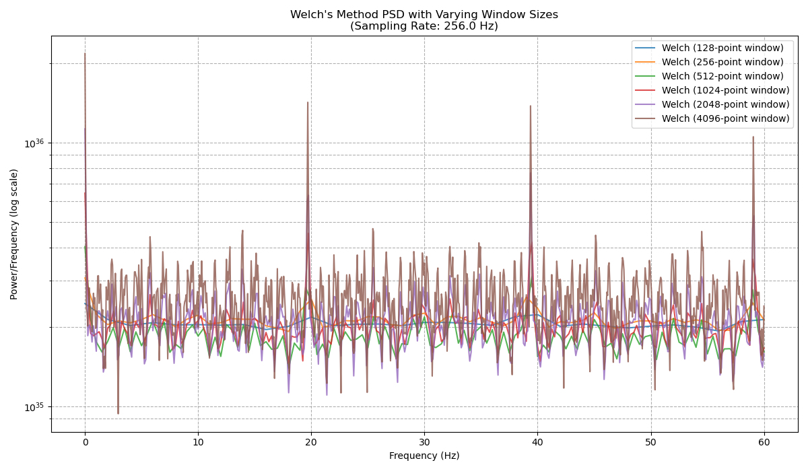

# EEG Signal Analysis Pipeline in C and Python

This project provides a comprehensive pipeline for analyzing time-series data, specifically tailored for EEG signals from the [Kaggle EEG Brainwave Dataset](https://www.kaggle.com/datasets/birdy654/eeg-brainwave-dataset-mental-state). The core analysis is performed in C for high performance, with Python scripts for advanced visualization and statistical analysis.

The primary goal is to estimate the Power Spectral Density (PSD) of the `lag1_mean_0` signal feature using multiple standard methods, benchmark their computational cost, and provide a deep comparative analysis of the results.

## Key Features

-   **High-Performance Core:** All numerical processing, including FFTs and statistical calculations, is done in C using the FFTW3 library.
-   **Automated Workflow:** A `build.sh` script handles the entire pipeline: cleaning, compiling, executing the C analyzer, and running the Python plotter.
-   **Multiple PSD Methods:** Implements and compares three fundamental PSD estimation techniques:
    1.  Periodogram
    2.  Welch's Method
    3.  Multitaper Method (simplified implementation)
-   **In-Depth Welch Analysis:** Automatically runs Welch's method with multiple window sizes (128, 256, 512, 1024, 2048, 4096) to demonstrate the trade-off between frequency resolution and variance.
-   **Comprehensive Benchmarking:** Measures and reports the execution time, CPU usage (user/system), and peak memory usage for each analysis method.
-   **Advanced Visualization:** Generates a rich set of plots using Python's Matplotlib, including:
    -   Raw signal and autocorrelation plots with physical units (seconds, Hz).
    -   Individual PSD plots for each method, annotated with performance metrics and EEG frequency bands.
    -   A direct comparison plot overlaying the results of the three main PSD methods.
    -   A comparative plot showing the effect of different window sizes for Welch's method.
    -   A distribution analysis plot with histograms and Gaussian fits to visualize the variance of each PSD estimator.
-   **Statistical Analysis:** Performs a Shapiro-Wilk test for Gaussianity on the PSD results and displays the p-value on each respective plot.

## Example Output

The pipeline generates multiple insightful plots, such as the comparison of Welch's method with different window sizes and the distribution of PSD values.

| Welch's Method Comparison                                  | PSD Distribution Analysis                                    |
| ---------------------------------------------------------- | ------------------------------------------------------------ |
|  |  |

## Project Structure

```
.
├── mental-state.csv
├── build.sh
├── Makefile
├── README.md
├── results/
│   ├── data/
│   ├── plots/
│   └── performance/
├── src/
│   ├── main.c
│   ├── csv_parser.h
│   ├── csv_parser.c
│   ├── signal_processing.h
│   ├── signal_processing.c
│   ├── performance_monitor.h
│   └── performance_monitor.c
└── scripts/
    └── plotter.py
```

## Prerequisites

### C Environment
You need a C compiler (like GCC), Make, and the FFTW3 library.

-   **On Debian/Ubuntu:**
    ```bash
    sudo apt-get update
    sudo apt-get install build-essential libfftw3-dev
    ```
-   **On Fedora/CentOS:**
    ```bash
    sudo dnf install gcc make fftw-devel
    ```

### Python Environment
You need Python 3 and the following libraries: `numpy`, `matplotlib`, and `scipy`.

-   **Install with pip:**
    ```bash
    pip install numpy matplotlib scipy
    ```

## How to Run

The `build.sh` script automates the entire process.

1.  **Make the script executable:**
    ```bash
    chmod +x build.sh
    ```

2.  **Build and Run:**
    This single command performs a full clean, build, and run cycle. It compiles the C code, runs the analysis, and then displays all generated plots in simultaneous pop-up windows.
    ```bash
    ./build.sh
    ```    *Note: You must close all plot windows for the script to terminate.*

3.  **Clean Up Only:**
    If you only want to remove all generated files (build artifacts, results), run:
    ```bash
    ./build.sh clean
    ```

## Output Description

All output is stored in the `results/` directory, which is created automatically.

-   `results/plots/`: Contains all generated plots saved as `.png` files.
-   `results/data/`: Contains intermediate data files (`.txt`) generated by the C analyzer for the Python script to consume. This includes the raw signal, autocorrelation, and PSD data for each method.
-   `results/performance/`: Contains `performance.txt`, a CSV file with the detailed computational cost metrics for each analysis run.

## Analysis Methods Implemented

-   **Signal Plotting:** The raw `lag1_mean_0` signal feature plotted over time.
-   **Autocorrelation:** Measures the similarity of the signal with a delayed copy of itself.
-   **Periodogram:** A direct FFT-based PSD estimate, known for its high variance.
-   **Welch's Method:** An improved PSD estimate that reduces variance by averaging the periodograms of overlapping, windowed signal segments. A Hanning window is used.
-   **Multitaper Method:** A variance-reduction technique that averages periodograms computed from the same signal segment but multiplied by different orthogonal tapers (windows). This project uses a simplified implementation with sine tapers.
-   **Gaussianity Test:** A Shapiro-Wilk test is performed on the log-scaled PSD values to statistically assess if they follow a normal (Gaussian) distribution.
-   **Gaussian Fit:** A normal distribution curve is calculated and overlaid on the PSD distribution histograms to visually compare the data to a true Gaussian shape.