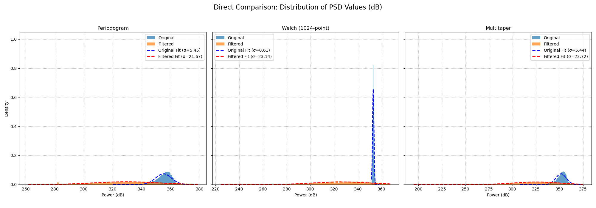

# EEG Signal Analysis Pipeline in C and Python

This project provides a comprehensive pipeline for analyzing time-series data, specifically tailored for EEG signals from the [Kaggle EEG Brainwave Dataset](https://www.kaggle.com/datasets/birdy654/eeg-brainwave-dataset-mental-state). The core analysis is performed in C for high performance, with Python scripts for direct, publication-quality visualization.

The primary goal is to perform a **comparative analysis** of an EEG signal in its raw state versus a pre-processed, filtered state. The pipeline demonstrates the effectiveness of a high-order digital filter in isolating brainwave frequencies and enabling a more stable Power Spectral Density (PSD) estimation.

## Key Features

-   **Comparative Analysis (Original vs. Filtered):** The entire pipeline runs twice: once on the raw signal and once on a filtered version. All generated plots are designed to overlay the results for a direct, clear comparison.
-   **High-Performance Core:** All numerical processing, including filtering, FFTs, and statistical calculations, is done in C using the FFTW3 library for maximum speed.
-   **Advanced Signal Pre-processing:** Implements a robust pre-processing stage in C that includes:
    -   **Detrending:** Removes linear trends from the signal.
    -   **4th-Order Butterworth Filter:** Applies a high-order IIR filter to isolate frequencies between 1-40 Hz, providing a very sharp and effective frequency cutoff.
-   **Multiple PSD Methods:** Implements and compares three fundamental PSD estimation techniques:
    1.  Periodogram
    2.  Welch's Method
    3.  Multitaper Method (simplified implementation)
-   **Direct, Unsmoothed Visualization:** Generates a rich set of comparison plots using Python. The plots render the **raw, unmodified data** from the C analyzer, ensuring a transparent view of the results without any visual smoothing.
-   **Comprehensive Benchmarking:** Measures and reports execution time, CPU usage (user/system), and peak memory usage for each analysis method.
-   **Statistical Distribution Analysis:** Includes histograms and Gaussian fits to compare the statistical variance of each PSD estimator, quantitatively demonstrating the stability benefits of Welch's method.

## Sample Output

The pipeline generates a comprehensive set of plots to compare the original and filtered signals. Here are a few key examples:

| Welch's Method Comparison | PSD Distribution Analysis |
| :---: | :---: |
|  |  |

## Execution Workflow

The entire pipeline is orchestrated by the `build.sh` script, which automates the compilation, execution, and visualization steps. The data flows from the raw CSV file through the C analyzer to intermediate text files, which are finally rendered by the Python plotter.

```
[mental-state.csv] -> build.sh -> [C Analyzer] -> [TXT Results] -> [Python Plotter] -> [PNG Plots & Display]
```

The process is as follows:

1.  **Compilation:** The `build.sh` script first invokes the `Makefile`. The `make` command compiles all C source files located in the `src/` directory into object files and links them into a single executable binary named `analyzer` inside the `build/` directory.

2.  **C Analyzer Execution:** The script then runs the compiled `analyzer` program. This is the core numerical engine of the pipeline, and it performs its analysis in two main passes:
    *   **Pass 1 (Original Signal):** The program reads the `lag1_mean_0` column from the source CSV. It then performs the full suite of analyses (Autocorrelation, Periodogram, Welch's, Multitaper) on this raw data. The numerical results are written to `.txt` files in `results/data/`, and the performance metrics are logged in `results/performance/performance.txt`.
    *   **Pass 2 (Filtered Signal):** The program creates an in-memory copy of the original signal. It applies a linear detrend and the 4th-order Butterworth band-pass filter to this copy. It then re-runs the *exact same suite of analyses* on this new, filtered signal. The results are saved to separate `.txt` files, distinguished by a `_filtered` suffix.

3.  **Python Visualization:** Once the C program finishes, `build.sh` executes the `scripts/plotter.py` script. This script handles all visualization:
    *   It reads all the intermediate `.txt` files (both original and filtered results) from the `results/data/` directory.
    *   It also reads the performance log to display benchmark metrics on the plots.
    *   It converts the raw PSD data to the standard decibel (dB) scale for proper visualization.
    *   Using Matplotlib, it generates all the comparative plots, saving each one as a `.png` file in `results/plots/`.
    *   Finally, it displays all generated plots in interactive windows for the user to inspect.

## Methodology and Results Analysis

### Mathematical Foundations

The core of this project relies on standard digital signal processing techniques to analyze the signal in both the time and frequency domains.

1.  **4th-Order Butterworth (IIR) Filter:** The filtering is achieved using a digital Infinite Impulse Response (IIR) filter defined by a difference equation. This equation calculates each new output sample (`y[n]`) based on current and past input samples (`x`) and past output samples (`y`). The general form is:

    $$ y[n] = \sum_{i=0}^{P} b_i x[n-i] - \sum_{j=1}^{Q} a_j y[n-j] $$

    Where `b_i` and `a_j` are the pre-calculated filter coefficients that define its band-pass characteristics. A 4th-order filter provides a significantly steeper rolloff than lower-order filters.

2.  **Autocorrelation:** Measures the similarity between a signal and a time-delayed version of itself. For a discrete signal `x[n]`, the autocorrelation `R(l)` at lag `l` is:

    $$ R(l) = \sum_{n} x[n] \cdot x[n+l] $$

3.  **Periodogram PSD Estimate:** The periodogram is a direct estimate of the Power Spectral Density based on the Discrete Fourier Transform (DFT). It is known for being computationally efficient but having high variance.

    $$ P_{xx}(f) = \frac{1}{N} |X(f)|^2 $$

    Where `N` is the number of signal points and `X(f)` is the DFT of the signal `x[n]`.

4.  **Welch's Method PSD Estimate:** This method reduces the variance of the periodogram by averaging. The signal is split into `K` overlapping segments, each segment is multiplied by a window function (Hanning, in this case), and the periodogram of each windowed segment is calculated. The final PSD is the average of these individual periodograms.

    $$ P_{Welch}(f) = \frac{1}{K} \sum_{k=1}^{K} P_{xx}^{(k)}(f) $$

### Analysis of Results

The generated plots clearly demonstrate the success of the analysis pipeline:

-   **Time Domain Analysis:** The `Full Signal in Time Domain` plot shows that the 4th-order filter effectively suppresses high-amplitude spikes and high-frequency noise present in the original signal. The resulting filtered signal is much cleaner, representing the underlying brainwave activity more accurately.

-   **Frequency Domain Analysis (PSD Plots):** The Periodogram, Welch, and Multitaper plots all confirm the filter's effectiveness. The filtered signal's power is sharply concentrated within the designated 1-40 Hz passband. The steep drop-off in power precisely at 40 Hz is characteristic of the high-order Butterworth filter and shows its superiority in isolating the desired frequency range.

-   **Autocorrelation Analysis:** The `Autocorrelation` plot reveals a more distinct and persistent oscillatory pattern in the filtered signal compared to the original. This indicates that by removing aperiodic noise, the filter has successfully exposed the rhythmic, periodic nature of the underlying EEG brainwaves.

-   **Statistical Stability:** The `Distribution of PSD Values` plot provides a key insight. The distribution for Welch's method is dramatically narrower and more peaked (lower standard deviation, σ) than for the Periodogram or Multitaper methods. This quantitatively proves that **Welch's method produces a more statistically stable and reliable PSD estimate**, which is a cornerstone of robust frequency analysis.

## Project Structure

```
.
├── mental-state.csv
├── build.sh
├── Makefile
├── README.md
├── results/
│   ├── data/
│   ├── plots/
│   └── performance/
├── src/
│   ├── main.c
│   ├── csv_parser.h
│   ├── csv_parser.c
│   ├── signal_processing.h
│   ├── signal_processing.c
│   ├── performance_monitor.h
│   └── performance_monitor.c
└── scripts/
    └── plotter.py
```

## Prerequisites

### C Environment
You need a C compiler (like GCC), Make, and the FFTW3 library.

-   **On Debian/Ubuntu:**
    ```bash
    sudo apt-get update
    sudo apt-get install build-essential libfftw3-dev
    ```
-   **On Fedora/CentOS:**
    ```bash
    sudo dnf install gcc make fftw-devel
    ```

### Python Environment
You need Python 3 and the following libraries: `numpy`, `matplotlib`, and `scipy`.

-   **Install with pip:**
    ```bash
    pip install numpy matplotlib scipy
    ```

## How to Run

The `build.sh` script automates the entire process.

1.  **Make the script executable:**
    ```bash
    chmod +x build.sh
    ```

2.  **Build and Run:**
    This single command performs a full clean, build, and run cycle. It compiles the C code, runs the analysis on both signals, and then displays all generated plots in simultaneous pop-up windows.
    ```bash
    ./build.sh
    ```
    *Note: You must close all plot windows for the script to terminate.*

3.  **Clean Up Only:**
    If you only want to remove all generated files (build artifacts, results), run:
    ```bash
    ./build.sh clean
    ```

## Output Description

All output is stored in the `results/` directory, which is created automatically.

-   `results/plots/`: Contains all generated comparison plots saved as `.png` files.
-   `results/data/`: Contains intermediate data files (`.txt`) generated by the C analyzer. Files with a `_filtered` suffix correspond to the pre-processed signal.
-   `results/performance/`: Contains `performance.txt`, a CSV file with the detailed computational cost metrics for each analysis run.